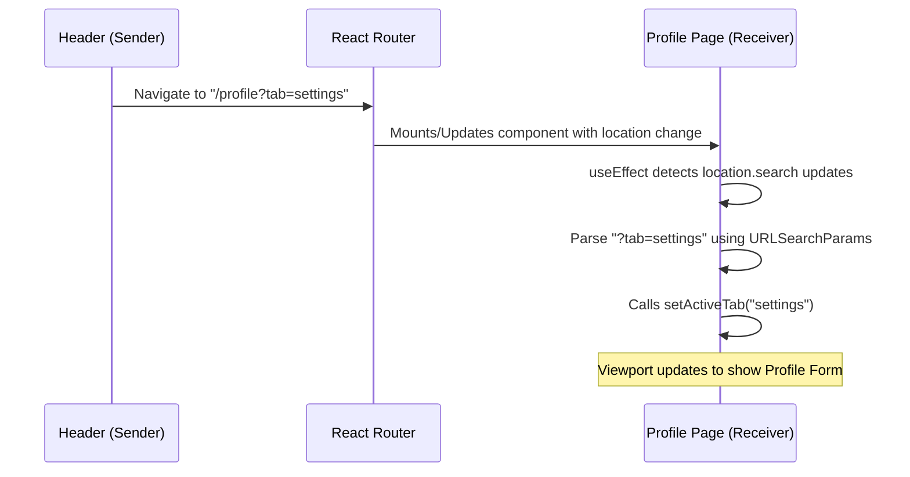

# Tab Synchronization via URL Query Parameters

In our application, when a user clicks a menu option in the navigation header (like **My Profile** or **Favorites**), the browser navigates to a URL containing query parameters:
* **My Profile**: `http://localhost:5173/profile?tab=settings`
* **Favorites**: `http://localhost:5173/profile?tab=favorites`

This guide explains the architecture of how these parameters are passed, detected, and synchronized with the Profile page's active tab state.

---

## The Workflow Architecture

The routing sync operates in a **Sender/Receiver** model:



---

## 1. The Sender: The Navigation Header (`Header1.jsx`)

In the navigation header dropdown menu, instead of using static route paths (like `/profile`), we append a **query string** containing the `tab` parameter:

```javascript
// Navigates to Settings tab
<Link
  to='/profile?tab=settings'
  onClick={() => setDropdownOpen(false)}
>
  My Profile
</Link>

// Navigates to Favorites tab
<Link
  to='/profile?tab=favorites'
  onClick={() => setDropdownOpen(false)}
>
  Favorites
</Link>
```

---

## 2. The Receiver: The Profile Page (`Profile.jsx`)

To capture the query parameter and switch the view, the Profile component executes three key steps:

### Step A: Import `useLocation`
We import the `useLocation` hook from `react-router-dom`. This hook returns the current `location` object, which is updated automatically by the router whenever the URL path or query string changes.

```javascript
import { useLocation } from 'react-router-dom';
```

### Step B: Access the Location Object
Inside the component, we instantiate the hook to retrieve `location.search` (which contains the string beginning with `?` e.g., `?tab=settings`).

```javascript
const location = useLocation();
```

### Step C: Parse and Synchronize with State (`useEffect`)
We register an effect hook that executes whenever `location.search` changes. It parses the query string and updates the tab state:

```javascript
// Listen to tab query parameters in URL (e.g. /profile?tab=settings)
useEffect(() => {
  // 1. Instantiate the native browser parser on the query string
  const urlParams = new URLSearchParams(location.search);
  
  // 2. Extract the value of the 'tab' parameter
  const tab = urlParams.get('tab');
  
  // 3. If a valid tab string is found, sync it to the activeTab state
  if (
    tab === 'settings' ||
    tab === 'favorites' ||
    tab === 'properties' ||
    tab === 'applications' ||
    tab === 'residences'
  ) {
    setActiveTab(tab);
  }
}, [location.search]); // Triggered every time the URL search parameters change
```

---

## Why this Pattern is Premium

1. **Direct Deep-Linking**: Users can share URLs directly to specific tabs. For instance, emailing a colleague `http://localhost:5173/profile?tab=properties` takes them straight to their listings rather than defaulting to settings.
2. **State Consistency**: Browser history (back/forward arrows) works seamlessly. Navigating from settings to favorites adds entries to the browser history, allowing standard navigation behaviors.
3. **Decoupled Components**: The header does not need access to the profile's state variables or setters; they communicate solely via the global URL address bar.
