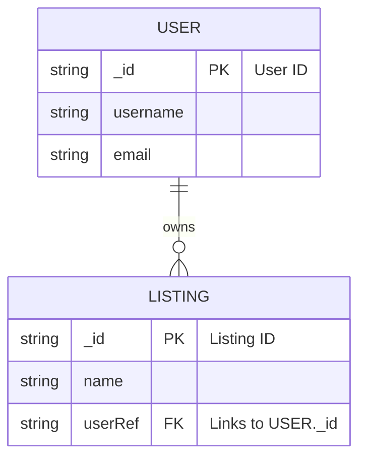

# Professional Developer Guide: Relational Modeling & Authorization via `userRef`

This document serves as a permanent reference guide explaining relational data modeling, data ownership, and role-based access control (authorization) using the `userRef` field in a MERN-stack architecture.

---

## ❓ The Questions (Reframed Professionally)
1. **"What is the role of `userRef` in connecting database schemas, and how does it mimic relational database foreign keys in MongoDB?"**
2. **"How do frontend components use ownership flags (`userRef` vs. `currentUser._id`) to conditionalize the user interface?"**
3. **"How does the backend verify data ownership in update/delete endpoints to prevent unauthorized access?"**

---

## 📊 1. Relational Modeling: One-to-Many Relationship

In this application, a **User** (Landlord/Agent) can create **multiple property listings**, but each **Listing** belongs to **only one User**.

This is represented in MongoDB as a **One-to-Many (1:N) relationship** using a reference key:



---

## 🔒 2. Backend Security & Access Control (Authorization)

Simply hiding buttons on the frontend is not secure; a hacker can still make direct requests to your server endpoints using tools like Postman. Therefore, the **backend controller must verify ownership** before performing write operations on a listing.

In [listing.controller.js](file:///f:/Web_D/Projects/Real_Estate_Website/backend/controllers/listing.controller.js#L19-L21), the backend compares the authenticated user's ID (`req.user.id` from JWT cookies) with the owner's reference (`listing.userRef` in MongoDB):

```javascript
// Example: deleteListing Controller
export const deleteListing = async (req, res, next) => {
  const listing = await Listing.findById(req.params.id);

  if (!listing) {
    return next(errorHandler(404, 'Listing not found!'));
  }

  // 🛡️ SECURITY AUDIT CHECK: Does the requester own this listing?
  if (req.user.id !== listing.userRef) {
    return next(errorHandler(401, 'You can only delete your own listings!'));
  }

  try {
    await Listing.findByIdAndDelete(req.params.id);
    res.status(200).json('Listing has been deleted!');
  } catch (error) {
    next(error);
  }
};
```

---

## 🛠️ 3. Frontend UI Guarding (Conditional Rendering)

On the client side, we use comparisons between the logged-in user state (`currentUser`) and the listing record's ownership reference (`listing.userRef`) to adapt the user interface.

### A. Creating a Listing: [CreateListing.jsx](file:///f:/Web_D/Projects/Real_Estate_Website/client/src/pages/Customer/CreateListing.jsx)
When the user submits the listing creation form, the frontend appends the logged-in user's database ID to establish the ownership link:
```javascript
body: JSON.stringify({
  ...formData,
  userRef: currentUser._id, // Relates the new listing to the active user
}),
```

### B. Displaying Contact Options: [Listing.jsx](file:///f:/Web_D/Projects/Real_Estate_Website/client/src/pages/Customer/Listing.jsx)
To prevent users from sending contact messages to themselves, the frontend hides the **Contact Landlord** trigger button if the logged-in user matches the listing owner:
```javascript
{currentUser && listing.userRef !== currentUser._id && !contact && (
  <button onClick={() => setContact(true)}>
    Contact landlord
  </button>
)}
```

### C. Retrieving Landlord Metadata: [PropertyContact.jsx](file:///f:/Web_D/Projects/Real_Estate_Website/client/src/pages/Customer/PropertyContact.jsx)
Once contact is initiated, `listing.userRef` is used as a foreign lookup key to query the backend and retrieve the landlord's contact details:
```javascript
useEffect(() => {
  const fetchLandlord = async () => {
    try {
      const res = await fetch(`/api/user/${listing.userRef}`);
      const data = await res.json();
      setLandlord(data);
    } catch (error) {
      console.error(error);
    }
  };
  fetchLandlord();
}, [listing.userRef]);
```

Once loaded, the landlord's email is bound to an email anchor layout:
```javascript
to={`mailto:${landlord.email}?subject=Regarding ${listing.name}&body=${message}`}
```

---

## ⚡ 4. Database Optimization: Indexing Foreign Keys

In SQL databases, foreign keys are indexed automatically. In NoSQL databases like MongoDB, lookup operations on non-indexed reference fields can slow down search queries as your collection grows.

### Best Practice:
Since you frequently search listings by `userRef` (e.g. to display the listings on a user's dashboard), you should add an **Index** to `userRef` inside your Mongoose listing schema:

```javascript
// listing.model.js
const listingSchema = new mongoose.Schema({
  // ...
  userRef: {
    type: String,
    required: true,
    index: true // ⚡ Tells MongoDB to index this field for extremely fast search queries!
  }
});
```
This reduces the query time from an **$O(N)$** collection scan to an **$O(\log N)$** index scan.

# This below text is generated from another chat of agent
# Understanding `userRef` in the Real Estate Application
In this project, `userRef` is a crucial identifier that links **Property Listings** back to the **Users (Landlords or Agents)** who created them. It serves as a relational foreign key in the application's MERN-stack architecture.
---
## 🔑 1. Database Modeling Context
In the database schema defined at [listing.model.js](file:///f:/Web_D/Projects/Real_Estate_Website/backend/models/listing.model.js#L53-L56), the `userRef` property is saved as a required `String` value:
```javascript
userRef: {
  type: String,
  required: true,
}
```
This field stores the unique MongoDB ObjectID (`_id`) of the user who owns the listing.
---
## 🛠️ 2. Frontend Usage Across JSX Components
Here is how `userRef` is processed dynamically in different client components:
### 📄 A. Creating Property Listings: [CreateListing.jsx](file:///f:/Web_D/Projects/Real_Estate_Website/client/src/pages/Customer/CreateListing.jsx#L168)
When submitting the creation form, the client attaches the logged-in user's database ID (`currentUser._id`) as the `userRef` key:
```javascript
body: JSON.stringify({
  ...formData,
  userRef: currentUser._id, // Assigns listing ownership to the logged-in user
}),
```
---
### 📄 B. Viewing Detailed Listings: [Listing.jsx](file:///f:/Web_D/Projects/Real_Estate_Website/client/src/pages/Customer/Listing.jsx)
When displaying a listing details page, the app checks if the viewing user is the one who created it.
If the current user is **not** the landlord (i.e. `currentUser._id !== listing.userRef`), the UI displays a "Contact Landlord" trigger button:
```javascript
{currentUser && listing.userRef !== currentUser._id && !contact && (
  <button onClick={() => setContact(true)}>
    Contact landlord
  </button>
)}
```
---
### 📄 C. Contacting Landlords: [PropertyContact.jsx](file:///f:/Web_D/Projects/Real_Estate_Website/client/src/pages/Customer/PropertyContact.jsx#L14)
When the visitor clicks "Contact landlord", the contact drawer requests the landlord's contact information (email/username) from the backend user API, using `listing.userRef` as the path parameter:
```javascript
useEffect(() => {
  const fetchLandlord = async () => {
    try {
      const res = await fetch(`/api/user/${listing.userRef}`); // Querying user metadata by their ID
      const data = await res.json();
      setLandlord(data);
    } catch (error) {
      console.log(error);
    }
  };
  fetchLandlord();
}, [listing.userRef]);
```
Once the landlord data loads, the component renders a `mailto:` link allowing direct emails to the landlord:
```javascript
to={`mailto:${landlord.email}?subject=Regarding ${listing.name}&body=${message}`}